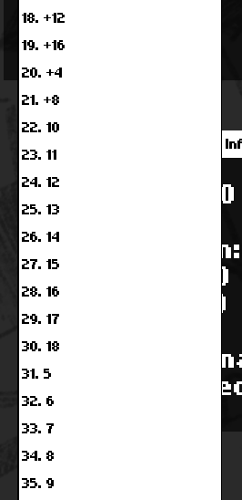
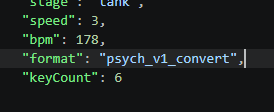

# How to chart

## Placing Notes
So, "How do I chart multikey?" you may be asking. It's quite simple! You use the multiple noteTypes included! You have a +4, +8, +12, and +16, along with individual notes. The + increase a notes noteData (which strum it's tied to) by that amount, and the individual are just for if you want to chart a 4 key version for anyone who doesnt have the multikey mod installed.

## I Don't See More Strums!
Fret not! You haven't done anything wrong! You may just need to add a KeyCount variable to your chart json. You can do this by opening your chart in a text editor, scrolling all the way down and adding "keyCount": # to the file, replacing # with how many strums your song uses.

## But I Still Don't See Them!!!!!!
Don't open the chart editor from the main menu. For some reason this causes the strum scripts to not be loaded, sticking you with a 4 key chart.