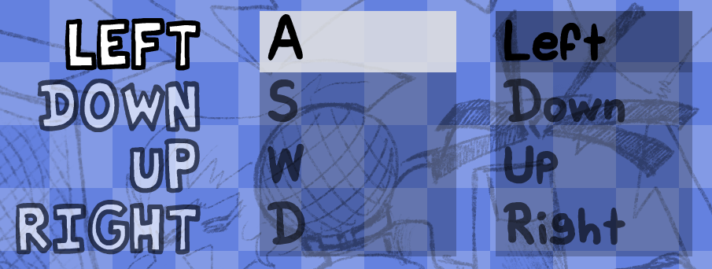
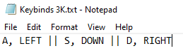
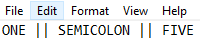

# How To Set KeyBinds

## What Are KeyBinds?
Keybinds are what you use to hit the notes, like you do with wasd and the arrow keys.

## How Do I Change My Binds?
It's just as simple as everything else! In the mod folder youll find a bunch of .txt files named KeyBinds #K.txt. Open up the one you want to edit, and youll find a bunch of keys separated by ||. These || indicate a spearation from the next strum, and the , inbetween two just splits the keybinds in them, so you can theoretically have as many binds as you want for any single strum.

## It Says Invalid Keybinds?
Don't worry! That just means your KeyBinds #K.txt is missing a keybind or two, just double check your binds!

## My Bind Isn't Working!
You're probably using smth like 5, ;, or / as a bind. Unfortunantly haxe doesnt read them like that, and you have to spell them out for it to recognize it.

