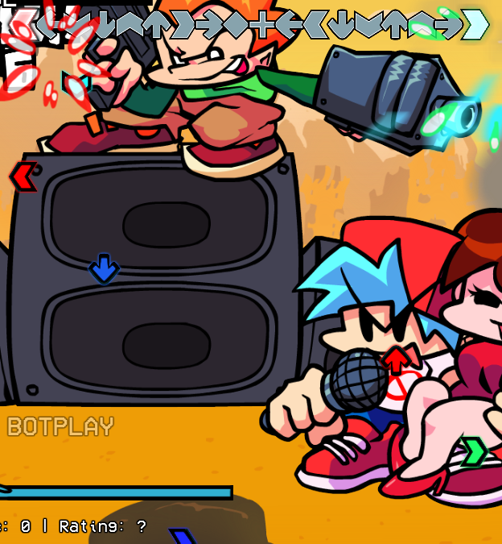

# NoteTypes

## How Do I Make A Compatible NoteType?
This is simple! Lets say you have a custom note all ready to go, but you want to tie it to a strum with a higher notedata. This is simple!

* For Lua: setPropertyFromGroup('unspawnNotes', i, 'extraData.realData', #, true)
* For Haxe: note.extraData.set("realData", #);

## It Overwrites my RGB Colors!
Just add:

* For Lua: setPropertyFromGroup('unspawnNotes', i, 'extraData.canChangeRGB', false, false)
* For Haxe: note.extraData.set("canChangeRGB", false);

# If You Want To Get More Specific
For Lua:

* setPropertyFromGroup('unspawnNotes', i, 'extraData.canChangeR', false, false)
* setPropertyFromGroup('unspawnNotes', i, 'extraData.canChangeG', false, false)
* setPropertyFromGroup('unspawnNotes', i, 'extraData.canChangeB', false, false)

For Haxe:

* note.extraData.set("canChangeR", false);
* note.extraData.set("canChangeG", false);
* note.extraData.set("canChangeB", false);

## It's Just Using The Default Noteskin!
It can't find your notetypes multikey texture, just make sure they're in the same spot.

