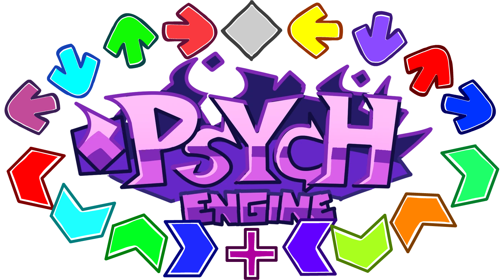

# Psych MultiKey
Converting Psych into a multikey engine.

## Credits:
* MC07 - Main Coder of Psychengine multikeys.
* Leather Engine Team - Boost notes for the default noteskin.

# How To Use
Guides on how to use this!

* [NoteSkins](/.github/docs/noteskins.md)
* [NoteTypes](/.github/docs/notetypes.md)
* [Charting](/.github/docs/charting.md)
* [Keybinds](/.github/docs/keybinds.md)

# Videos!

* ](https://youtu.be/zRtDpCCri6U)
* ](https://youtu.be/XHosqB8I26c)

